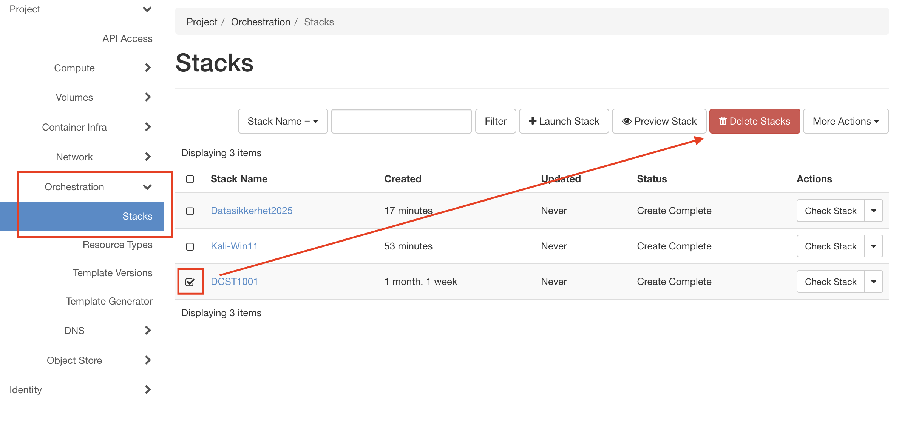
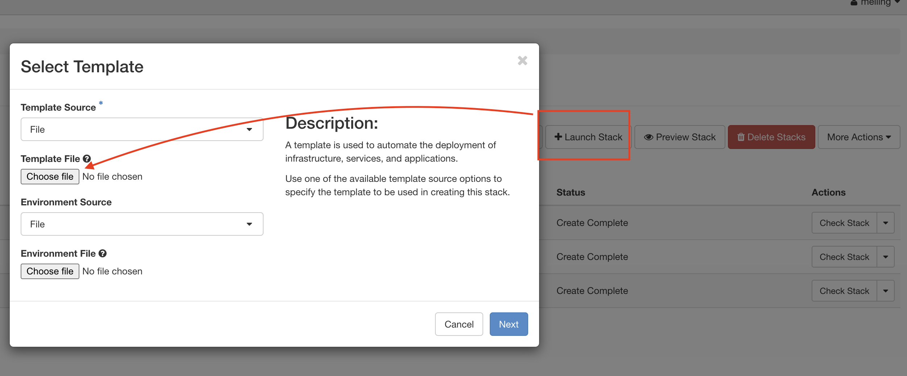
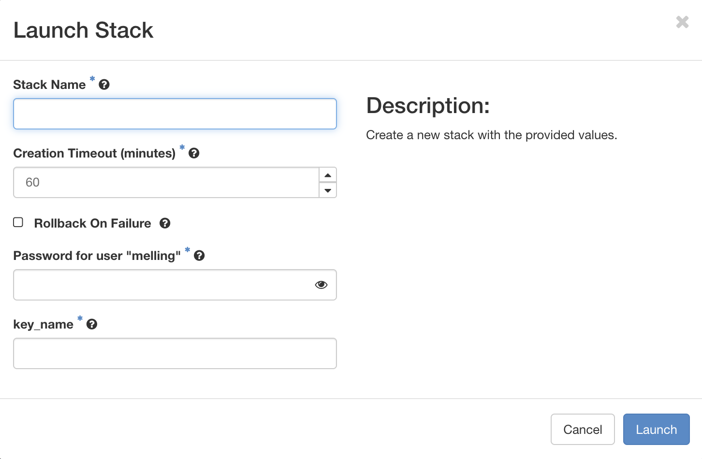

# NTNU Datasikkerhet Lab - BeeF XSS Framework

**Bachelor Digital infrastruktur og cybersikkerhet - 1. semester**  
**Emne:** Datasikkerhet  
**Mål:** Installere og teste BeeF (Browser Exploitation Framework) i et sikkert testmiljø


---

## 📋 Innholdsfortegnelse

1. [Før du starter](#før-du-starter)
2. [Steg 1: Logg inn på OpenStack](#steg-1-logg-inn-på-openstack)
3. [Steg 2: Last opp Heat Template](#steg-2-last-opp-heat-template)
4. [Steg 3: Deploy Stack](#steg-3-deploy-stack)
5. [Steg 4: Finn IP-adresser](#steg-4-finn-ip-adresser)
6. [Steg 5: Koble til Kali Linux (RDP)](#steg-5-koble-til-kali-linux-rdp)
7. [Steg 6: Start BeeF](#steg-6-start-beef)
8. [Steg 7: Bruk BeeF Web-grensesnitt](#steg-7-bruk-beef-web-grensesnitt)
9. [Steg 8: Koble til Windows 11 (valgfritt)](#steg-8-koble-til-windows-11-valgfritt)
10. [Feilsøking](#feilsøking)
11. [Opprydding etter labøvelsen](#opprydding-etter-labøvelsen)
12. [Viktig sikkerhetsinformasjon](#viktig-sikkerhetsinformasjon)

---

## Før du starter

### 🛠️ Du trenger
- ✅ NTNU brukernavn og passord
- ✅ SSH Key registrert i OpenStack (vi har opprettet det tidligere)
- ✅ RDP-klient installert på din maskin:
  - **Windows:** Innebygd "Remote Desktop Connection" (Tilkobling til eksternt skrivebord)
  - **macOS:** Last ned "Windows App" fra App Store (alt gjort tidligere i faget)
  - **Linux:** Installer Remmina (`sudo apt install remmina`)
- ✅ Heat template-filen: `beef-lab.yaml`
- [beef-lab.yaml](https://raw.githubusercontent.com/torivarm/dcst1001/refs/heads/main/beef-lab.yaml.yaml)

### ⏱️ Tidsestimat:
- Deploy av stack: **10-15 minutter**
- Installasjon av programvare: **20-25 minutter**
- **Total tid:** Ca. 35-40 minutter før alt er klart

---

## Steg 1: Logg inn på OpenStack

### 1.1 Åpne nettleser
Gå til: **https://skyhigh.iik.ntnu.no/**

### 1.2 Logg inn med NTNU-bruker
1. Skriv inn ditt NTNU brukernavn
2. Skriv inn ditt NTNU passord
3. Fullfør eventuell to-faktor autentisering

### 1.3 Verifiser innlogging
Du skal nå se OpenStack Dashboard med menyer på venstre side.

---

## Steg 2: Last opp Heat Template

### 2.1 Gå til Orchestration
1. Klikk på **Orchestration**
2. Klikk på **Stacks**
3. Slett eksisterende stacks om du har noen fra før
   1. 
4. Vent til stack er slettet

### 2.2 Start Launch Stack
Klikk på knappen **"Launch Stack"** (øverst til høyre)

### 2.3 Velg Template Source
1. Under **Template Source**, velg: **File**
2. Klikk **Choose File** / **Browse**
3. Velg filen `beef-lab.yaml` som du har fått utdelt
4. Klikk **Next**

---

## Steg 3: Deploy Stack

### 3.1 Fyll ut Stack-detaljer

**Stack Name:**
```
beef-lab-<ditt-brukernavn>
```
Eksempel: `beef-lab-ole123`

**Description:** (valgfritt)
```
BeeF Lab for Datasikkerhet
```

**Password for user "DITTBRUKERNAVN":**  
Skriv inn ditt NTNU passord

### 3.2 Skriv inn Key Name
key_name: Skriv inn det samme navnet som har på tidligere opprettet key pair. (tidligere lastet ned .pem fil i forbindelse med deployment av Windows 11 og Windows Server og WireShark testing)

### 3.3 Launch Stack
1. Klikk **Launch** (nederst til høyre)
2. Du blir sendt til Stack-oversikten

### 3.4 Vent på deployment
**Dette skjer nå:**
1. OpenStack oppretter nettverk og security groups
2. Kali Linux og Windows 11 VMs startes
3. Cloud-init installerer programvare på Kali Linux

> ⏳ **Viktig:** Selv når stacken viser CREATE_COMPLETE, må du vente **35-40 minutter** til før BeeF og GUI er installert og Windows 11 ferdig konfigurert og du kan hente ut passordet i OpenStack.

---

## Steg 4: Finn IP-adresser

### 4.1 Åpne Stack Details
1. Klikk på navnet til stacken din (f.eks. `beef-lab-ole123`)
2. Du kommer til **Stack Details**-siden

### 4.2 Gå til Overview-fanen
Klikk på fanen **Overview** (hvis ikke allerede valgt)

### 4.3 Se Outputs
Scroll ned til seksjonen **Outputs**. Her finner du:

```
kali_public_ip:     10.212.xxx.xxx
win11_public_ip:    10.212.xxx.xxx
paalogging:         "Start BeeF med sudo beef-xss..."
```

> 📝 **NOTER DISSE IP-ADRESSENE!** Du trenger dem for RDP-tilkobling.


**Alternativ måte:**
1. Gå til **Project → Compute → Instances**
2. Se på tabellen - IP-adresser står i kolonnen "IP Address"

---

## Steg 5: Koble til Kali Linux (RDP)

### 5.1 Åpne RDP-klient

**Windows:**
1. Trykk `Windows-tast + R`
2. Skriv: `mstsc`
3. Trykk Enter

**macOS:**
1. Åpne **Microsoft Remote Desktop**
2. Klikk **Add PC**

**Linux:**
1. Åpne **Remmina**
2. Klikk på **+** (New connection)

### 5.2 Fyll inn tilkoblingsdetaljer

**Computer / Server:**
```
10.212.xxx.xxx:3389
```
(Bruk Kali IP-adressen fra Steg 4)

**Username / Brukernavn:**
```
student
```

**Password / Passord:**
```
Kali2025
```


### 5.3 Koble til
1. Klikk **Connect** / **Koble til**
2. Hvis du får sertifikatadvarsel, klikk **Yes** / **Ja** / **Continue**

### 5.4 Verifiser tilkobling
Du skal nå se **XFCE Desktop** med Kali Linux-bakgrunn!


> 🐛 **Får du ikke tilkobling?** Se [Feilsøking](#feilsøking)

---

## Steg 6: Start BeeF

### 6.1 Åpne Terminal
På Kali Desktop:
1. Klikk på **Applications**-menyen (øverst til venstre)
2. Velg **Terminal Emulator**

Eller bruk snarvei: `Ctrl + Alt + T`

### 6.2 Start BeeF
I terminalen, skriv:
```bash
sudo beef-xss
```

Trykk Enter.

### 6.3 Skriv inn passord
Når du blir bedt om passord:
```
Kali2025
```

Trykk Enter.


### 6.4 Vent på oppstart
Du vil se masse tekst i terminalen. Vent til du ser noe lignende:

```
[*] Browser Exploitation Framework (BeEF) 0.5.x.x
[*] Web UI: http://127.0.0.1:3000/ui/panel
[*] Hook URL: http://10.212.xxx.xxx:3000/hook.js
```

> ✅ **BeeF kjører nå!** La terminalvinduet stå åpent.

---

## Steg 7: Bruk BeeF Web-grensesnitt

### 7.1 Åpne Firefox
På Kali Desktop:
1. Klikk på **Applications**
2. Velg **Firefox ESR**

### 7.2 Gå til BeeF UI
I adresselinjen, skriv:
```
http://127.0.0.1:3000/ui/panel
```

Trykk Enter.


### 7.3 Logg inn på BeeF
**Brukernavn:**
```
beef
```

**Passord:**
```
beef
```

Klikk **Login**.


### 7.4 Utforsk BeeF-grensesnittet

Du skal nå se BeeF's hovedgrensesnitt med:
- 🖥️ **Hooked Browsers** (venstre side) - Viser "hooked" nettlesere
- 📊 **Current Browser** (midten) - Info om valgt nettleser
- 🎯 **Commands** (høyre side) - Kommandoer du kan kjøre


---

## Steg 8: Koble til Windows 11 (valgfritt)

Windows 11-maskinen er tilgjengelig for testing av BeeF-angrep.

### 8.1 Finn Windows IP
Fra Stack Outputs (Steg 4):
```
win11_public_ip: 10.212.xxx.xxx
```

### 8.2 Koble til med RDP
**Computer:**
```
10.212.xxx.xxx:3389
```

**Username:**
```
Administrator
```

**Password:**  
Windows 11 bruker standard Windows-passord. Spør faglærer hvis nødvendig.

### 8.3 Test BeeF Hook
På Windows 11-maskinen:
1. Åpne Edge/Chrome
2. Gå til en testside med BeeF hook injisert
3. Se maskinen dukke opp i BeeF's "Hooked Browsers"

---

## Feilsøking

### ❌ Problem: "Stack creation failed"

**Løsning:**
1. Sjekk at du valgte riktig SSH-nøkkel
2. Slett stacken (Delete Stack)
3. Prøv igjen med Launch Stack

---

### ❌ Problem: "Cannot connect via RDP"

**Mulige årsaker:**

**1. Installasjon ikke ferdig enda**
- Vent 15 minutter etter CREATE_COMPLETE
- Sjekk status: SSH inn og kjør `cloud-init status`

**2. Feil IP-adresse**
- Dobbeltsjekk IP fra Stack Outputs
- Prøv å ping IP-adressen: `ping 10.212.xxx.xxx`

**3. Port 3389 blokkert**
- Sjekk at Security Group har port 3389 åpen
- Gå til Project → Network → Security Groups
- Klikk på `beef-lab-security`
- Verifiser regel for port 3389

**4. RDP-service ikke startet**
- SSH inn til Kali: `ssh student@10.212.xxx.xxx`
- Sjekk xrdp: `sudo systemctl status xrdp`
- Start hvis nødvendig: `sudo systemctl start xrdp`

---

### ❌ Problem: "BeeF starter ikke"

**Løsning 1: Sjekk om BeeF er installert**
```bash
which beef-xss
```
Hvis ingenting vises, installer manuelt:
```bash
sudo apt update
sudo apt install beef-xss
```

**Løsning 2: Port 3000 i bruk**
```bash
sudo netstat -tuln | grep 3000
```
Hvis opptatt, drep prosessen:
```bash
sudo pkill -f beef
```
Prøv igjen: `sudo beef-xss`

---

### ❌ Problem: "Kan ikke nå BeeF web-grensesnitt"

**Løsning:**
1. Sjekk at BeeF kjører i terminalen
2. Bruk **127.0.0.1** eller **localhost**, IKKE Kali's offentlige IP
3. Sjekk at Firefox er startet **på Kali-maskinen** (ikke din lokale maskin)

---

### ❌ Problem: "Glemt passord til BeeF"

**Standard BeeF pålogging:**
- Brukernavn: `beef`
- Passord: `beef`

Hvis endret, finn det i:
```bash
sudo cat /etc/beef-xss/config.yaml | grep user
```

---

## Opprydding etter labøvelsen

### ⚠️ VIKTIG: Slett stacken når du er ferdig!

Dette frigjør ressurser og forhindrer ekstra kostnader.

### Slik sletter du stacken:
1. Gå til **Project → Orchestration → Stacks**
2. Finn din stack (f.eks. `beef-lab-ole123`)
3. Klikk på pilen ved siden av stacken
4. Velg **Delete Stack**
5. Bekreft sletting


**Dette sletter:**
- ✅ Begge VM-ene (Kali og Windows)
- ✅ Nettverk og router
- ✅ Floating IPs
- ✅ Security groups

> 💾 **Husk:** All data på VM-ene blir slettet! Ta backup hvis nødvendig.

---

## Viktig sikkerhetsinformasjon

### 🔒 Etiske retningslinjer

**BeeF er et kraftig verktøy som KUN skal brukes:**
- ✅ I dette labmiljøet
- ✅ På systemer du eier eller har eksplisitt tillatelse til å teste
- ✅ For undervisnings- og læringsformål

**ALDRI:**
- ❌ Test BeeF på nettsider eller systemer du ikke eier
- ❌ Bruk BeeF utenfor NTNU's labmiljø uten tillatelse
- ❌ Del BeeF hook-URLer med uvedkommende
- ❌ Angrip andre studenters maskiner uten avtale

### ⚖️ Juridisk informasjon

Uautorisert bruk av BeeF kan være straffbart etter:
- **Straffeloven § 204** - Datainnbrudd
- **Straffeloven § 291** - Skadeverk

**Husk:** At noe er teknisk mulig betyr ikke at det er lovlig eller etisk riktig!

---

## Nyttige kommandoer

### På Kali Linux:

**Se IP-adresse:**
```bash
ip addr show
```

**Stopp BeeF:**
```
Ctrl + C
```
(i terminalen der BeeF kjører)

**Restart xrdp:**
```bash
sudo systemctl restart xrdp
```

**Se cloud-init status:**
```bash
cloud-init status
```

**Se cloud-init log:**
```bash
sudo cat /var/log/cloud-init-output.log
```

**Finn BeeF konfigurasjon:**
```bash
cat /etc/beef-xss/config.yaml
```

---

## Ressurser

### 📚 Dokumentasjon
- **BeeF Wiki:** https://github.com/beefproject/beef/wiki
- **Kali Linux Docs:** https://www.kali.org/docs/
- **NTNU OpenStack:** https://innsida.ntnu.no/wiki/-/wiki/Norsk/OpenStack

### 🆘 Support
- **OpenStack support:** it-hjelp@ntnu.no
- **Faglærer:** [Sett inn kontaktinfo]
- **Laboratorieassistent:** [Sett inn kontaktinfo]

### 🔗 Lenker
- **OpenStack Dashboard:** https://skyhigh.iik.ntnu.no/
- **NTNU IT-hjelp:** https://innsida.ntnu.no/it-hjelp

---

## Appendiks: Hvordan lage SSH-nøkkel

Hvis du ikke har SSH-nøkkel i OpenStack:

### På Windows (PowerShell):
```powershell
ssh-keygen -t ed25519 -C "dittbrukernavn@ntnu.no"
```

### På macOS/Linux (Terminal):
```bash
ssh-keygen -t ed25519 -C "dittbrukernavn@ntnu.no"
```

**Følg instruksjonene:**
1. Trykk Enter for å bruke standard plassering
2. Skriv inn passphrase (valgfritt, kan være tomt)
3. Nøkkelen er lagret i `~/.ssh/id_ed25519`

### Importer til OpenStack:
1. Gå til **Project → Compute → Key Pairs**
2. Klikk **Import Public Key**
3. Kopier innholdet av `~/.ssh/id_ed25519.pub`
4. Lim inn i "Public Key"-feltet
5. Gi den et navn (f.eks. "min-ntnu-key")
6. Klikk **Import Key Pair**

---

## Sjekkliste før du starter

- [ ] Jeg har logget inn på https://skyhigh.iik.ntnu.no/
- [ ] Jeg har SSH-nøkkel registrert i OpenStack
- [ ] Jeg har lastet ned `beef-lab.yaml`
- [ ] Jeg har RDP-klient installert
- [ ] Jeg har lest sikkerhetsinformasjonen
- [ ] Jeg er klar til å starte labøvelsen! 🚀

---

**Lykke til med labøvelsen!**

*Versjon 1.0 - Oktober 2025*