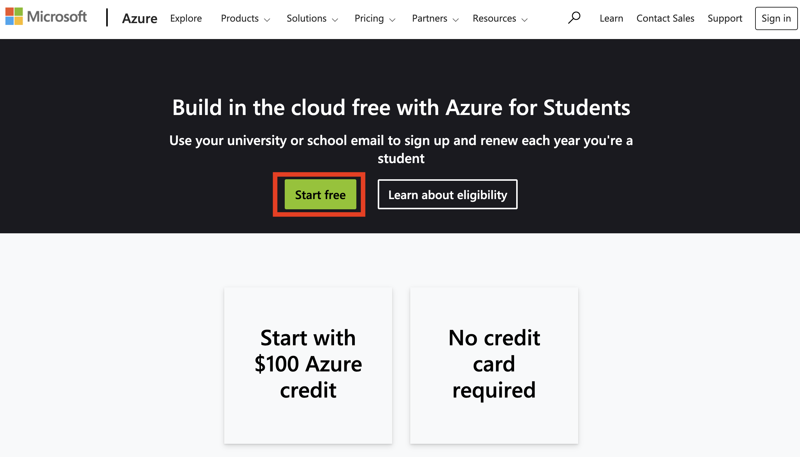
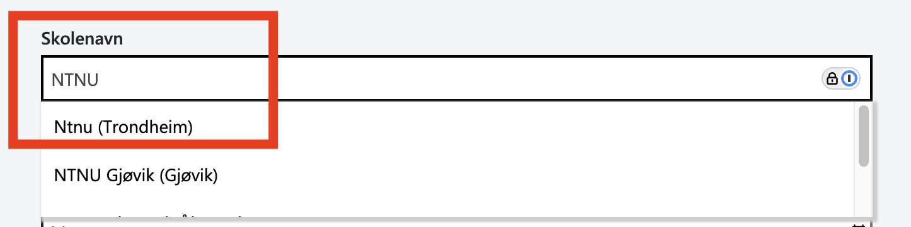
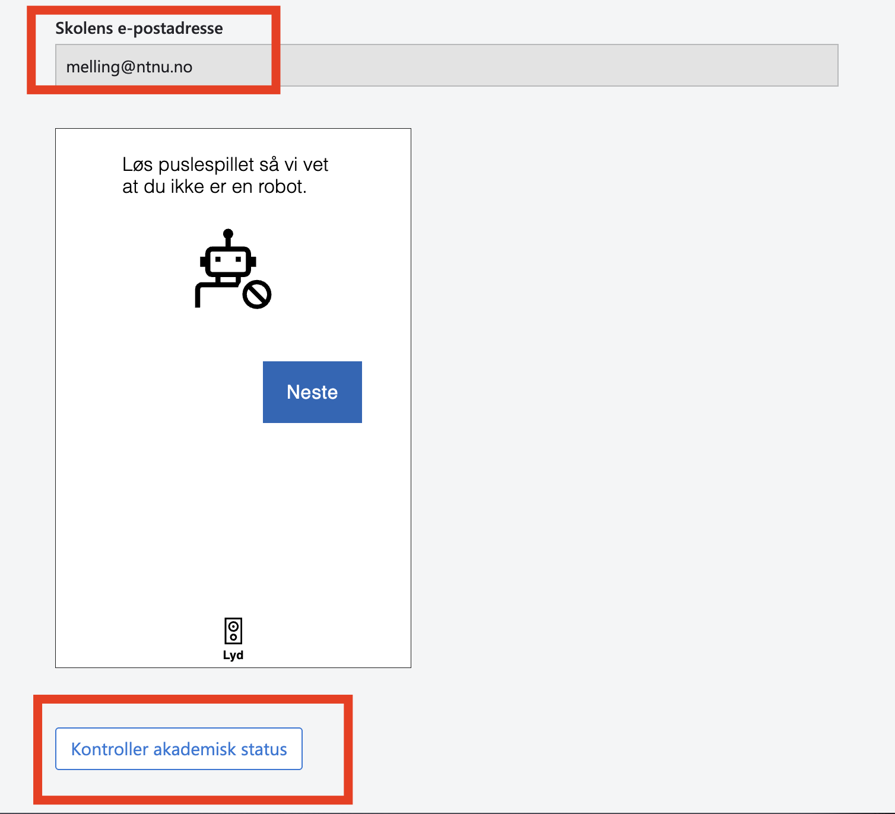

# Azure for Students - Registreringsguide

## Oversikt
Azure for Students gir deg $100 i Azure-kreditter som er gyldige i 12 måneder, uten å kreve kredittkort. Dette er perfekt for studenter som vil lære om cloud computing og utforske Azures tjenester.

## Steg-for-steg registrering

### Steg 1: Gå til Azure for Students-siden
Besøk den offisielle Azure for Students-siden:
```
https://azure.microsoft.com/nb-no/free/students/
```

### Steg 2: Klikk på "Start Free" eller "Start gratis"
Du vil finne en knapp på siden som lar deg starte registreringsprosessen.


### Steg 3: Logg inn med studentkontoen din
- Benytt studenteposten din
  - Om du benytter en nettleser hvor du allerede er autentisert mot Innsida, BlackBoard eller lignende, vil du automatisk sendt til FEIDE-pålogging
- Følg instruksjonene på skjermen for å fullføre innloggingen

### Steg 4: Verifiser studentstatusen din
Microsoft vil verifisere at du er student. Fyll inn informasjonen som siden for akademisk bekreftelse etterspør:
- Fornavn
- Etternavn
- Land
- Skolens navn (se bilde under)
- Fødselsdato

- **Automatisk verifisering**: Hvis du bruker en studentepostadresse, kan verifikasjonen skje automatisk. Velg NTNU og Trondheim som studiested.
  
-  Verifiser at det er korrekt adresse som står nederst på siden for akademisk bekreftelse.

- Velg deretter kontroller akademisk status nederst på siden.

- **Manuell verifisering**: Du kan bli bedt om å laste opp dokumentasjon som:
  - Studentbevis
  - Innmeldingsbekreftelse
  - Annen offisiell dokumentasjon fra skolen din

### Steg 6: Aksepter vilkårene
Aksepter Microsofts tjenestevilkår og personvernserklæring.

### Steg 7: Bekreft registreringen
- Du kan bli bedt om å verifisere telefonnummeret ditt via SMS eller telefonsamtale
- Følg instruksjonene for å fullføre verifikasjonen

### Steg 8: Få tilgang til Azure Portal
Når registreringen er godkjent, vil du få tilgang til Azure Portal:
```
https://portal.azure.com
```

Her kan du se dine $100 kreditter og begynne å bruke Azure-tjenester.

## Hva får du med Azure for Students?

### Inkluderte kreditter
- **$100 USD** i Azure-kreditter
- Gyldig i **12 måneder** fra aktiveringsdato

### Gratis tjenester
Mange Azure-tjenester er inkludert gratis (innenfor visse grenser):

### Ingen kredittkort nødvendig
I motsetning til den vanlige Azure Free Trial, krever ikke Azure for Students kredittkortinformasjon.

## Viktige ting å merke seg
**Slett alltid** ressurser som en ferdig med. Ubrukte ressurser som virtuelle maskiner trekker typisk alt fra 700,- til 2500,- i måneden avhengig av CPU, minne etc.

### Kredittovervåking
- Sjekk regelmessig hvor mye av kredittene dine som er brukt
- Gå til "Cost Management + Billing" i Azure Portal for å se forbruket ditt
- Sett opp varsler for å få beskjed når du nærmer deg kredittgrensen

### Fornyelse (frivillig)
- Etter 12 måneder eller når kredittene er brukt opp, må du fornye abonnementet
- Du kan fornye årlig så lenge du fortsatt er student
- Ved fornyelse får du nye $100 kreditter

### Begrensninger
- Noen premium-tjenester er ikke tilgjengelige
- Det er grenser på visse ressurser
- Kredittene kan ikke overføres eller refunderes

### Ressursstopp
- Hvis du bruker opp alle kredittene før 12 måneder, vil tjenestene dine bli stoppet
- Du vil ikke bli belastet med mindre du oppgraderer til et betalt abonnement
- Du kan når som helst oppgradere til Pay-As-You-Go hvis nødvendig

## Feilsøking

### Problemer med verifisering
- Sørg for at du bruker din offisielle studentepostadresse
- Hvis automatisk verifisering mislykkes, last opp gyldig studentdokumentasjon
- Kontakt Microsoft Support hvis problemene vedvarer

### Kan ikke finne kredittene
- Gå til "Subscriptions" i Azure Portal
- Velg "Azure for Students"
- Sjekk under "Cost Management" for å se kredittbalansen

### Ressurser blir ikke opprettet
- Sjekk at du har nok kreditter igjen
- Verifiser at du bruker riktig region (ikke alle regioner støttes)

## Nyttige lenker

- Azure for Students-portal: https://aka.ms/azureforstudents
- Azure Portal: https://portal.azure.com
- Azure-dokumentasjon: https://docs.microsoft.com/azure
- Microsoft Learn (gratis læringsstier): https://docs.microsoft.com/learn
- Azure Support: https://azure.microsoft.com/support

## Tips for å maksimere kredittene dine

1. **Start i det små**: Begynn med mindre ressurser og skaler opp etter behov
2. **Slå av ressurser når de ikke er i bruk**: Spesielt virtuelle maskiner
3. **Bruk gratis nivåer**: Mange tjenester har gratis nivåer du bør utnytte først
4. **Overvåk kostnader**: Sett opp budsjettavarsler i Cost Management
5. **Lær før du bruker**: Utforsk Microsoft Learn for å lære best practices
6. **Bruk utviklingsmiljøer**: Velg mindre VM-størrelser for utvikling og testing

