# Opprette en virtuell maskin i Azure med tilhørende nettverk

I denne guiden lærer du å opprette en virtuell maskin (VM) i Azure.  
I stedet for å la Azure opprette alt automatisk, bygger vi infrastrukturen steg for steg: først nettverket, deretter VM-en.  

Dette gir deg bedre forståelse for hvordan Azure er strukturert, og hvordan ressursene henger sammen.

---

## 1. Logg inn i Azure-portalen
1. Gå til [https://portal.azure.com](https://portal.azure.com).  
2. Logg inn med din studentkonto


---

## 2. Opprett en ressursgruppe
En ressursgruppe samler alle ressursene dine.  

1. Klikk på **Resource groups**  
2. Trykk **Create**.
   1. 
3. Fyll inn: MERK! Noen av bildene viser Sweden Central, men Azure for students subscription har fått en del nye begresninger om hvor en kan opprette VM-er. Velg derfor **Switzerland North**  
   - **Subscription**: `Azure for students` (om ikke Azure for students Subscription vises, forsøk å oppdatere MAC: command + r, Windows: CTRL + R)
   - **Resource group name**: Skriv inn et passende navn `rg-myfirstIaaS-test` 
   - **Region**: `Switzerland North` (MERK!! IKKE Sweden Central som bildet viser)  
4. Trykk **Review + Create**, og deretter **Create**.


---

## 3. Opprett et virtuelt nettverk (VNet)
Et VNet er et privat nettverk i Azure hvor du plasserer ressursene dine.  

1. Søk etter **Virtual Network**.
   1. 
2. Velg **Create**.
   1. 
3. Fyll inn:  
   - **Resource group**: Om den ikke er automatisk valgt, velg Resource Group som nettopp ble opprettet
   - **Name**: `vnet-myfirstVNET-test`  
   - **Region**: Samme som ressursgruppen

4. Ikke velg noe under security, koster veldig mye!! - Gå til: **IP addresses**, konfigurer et **subnet**:

   - **Subnet name**: `snet-myfirstSubnet-test`  
   - **Subnet address range**: behold standardforslaget, f.eks. `10.0.0.0/24`.

5. Trykk **Review + Create**, og deretter **Create**.

-

6. Etter en stund vil en se at ressursen er ferdig opprettet:

---

## 4. Opprett en Network Security Group (NSG)
En NSG fungerer som en brannmur. Den bestemmer hvilken trafikk som slipper inn og ut av subnettet.  

1. Søk etter **Network Security Group**.

2. Velg **Create**.
  
3. Fyll inn:  
   - **Resource group**: `rg-myfirstIaaS-test` - Samme som opprettet tidligere
   - **Name**: `nsg-myfirstNSG-test`  
   - **Region**: samme som VNet
4. Trykk **Review + Create**, og deretter **Create**.  


Når NSG-en er opprettet:
- Gå inn på `nsg-myfirstNSG-test`.
- 
- Velg **Inbound security rules**.
-   
- Legg til en regel for å åpne riktig port: Skriv inn et ønsket navn: F.eks. RDP og SSH for hver av reglene.
  - **Windows VM**: RDP (TCP/3389)
    -  
  - **Linux VM**: SSH (TCP/22) 
    - 
- Når en er ferdig vil en se følgende regler:
  - 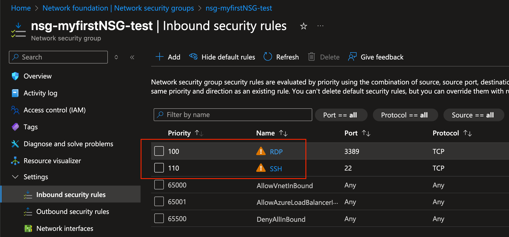
---

## 5. Knytt NSG til subnettet
1. Gå til opprettet **VNET** og deretter → **Subnets**.
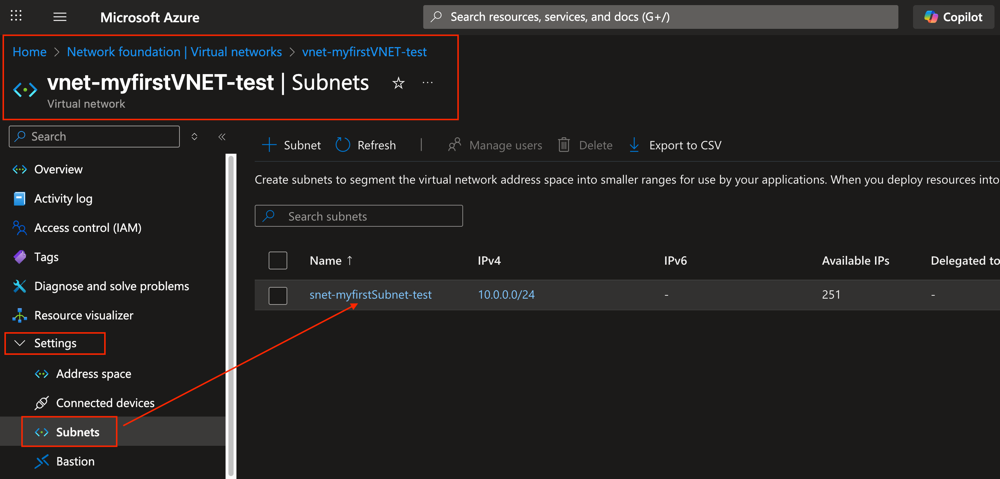
1. Velg `snet-myfirstSubnet-test` (eller det navnet du har valgt på ditt subnet)
2. Knytt til **nsg-myfirstNSG-test**.  
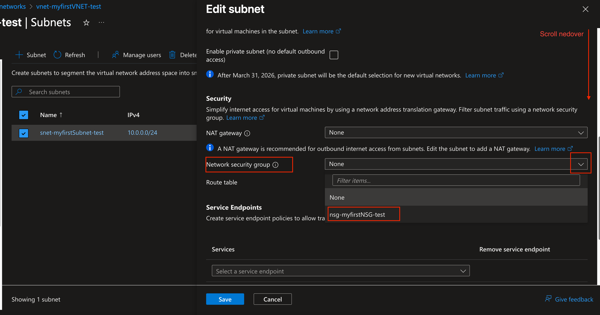
3. Lagre endringene.

Nå har du et nettverk klart med sikkerhetsregler.

---

## 6. Opprett en virtuell maskin
Nå kan du lage selve VM-en og koble den til nettverket du har satt opp.

1. Søk etter **Virtual Machine**.
   1. 
2. Velg **Create** → **Virtual Machine**
   1. 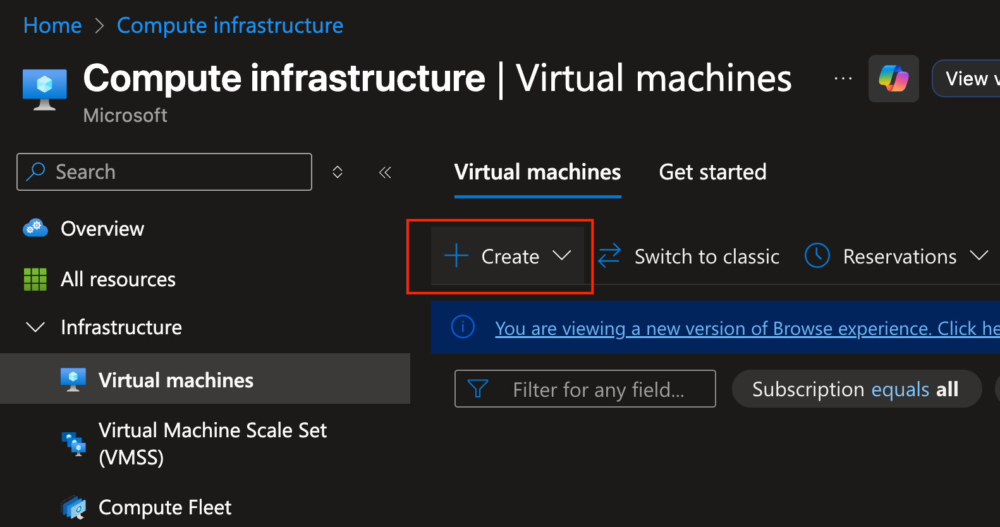  
3. Under **Basics**: MERK! Her er det mange valg.. Det er ikke meningen vi skal forstå alt sammen nå, det blir mer Azure i senere semester.
   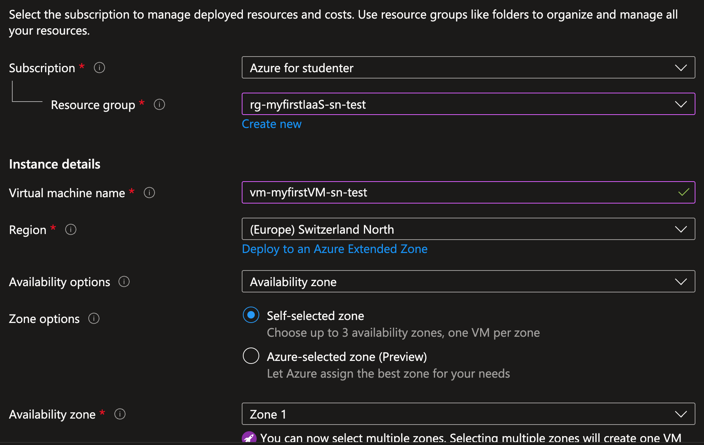
   - **Resource group**: `rg-myfirstIaaS-sn-test`  
   - **Virtual machine name**: `vm-myfirstVM-sn-test`
   - **Region**: samme som ressursgruppen (Switzerland North)
   - **Image**: velg operativsystem (f.eks. *Ubuntu 24.04 LTS*)  
- Velg å bytte SIZE på VM-en (SKU - Stock keeping unit)
- 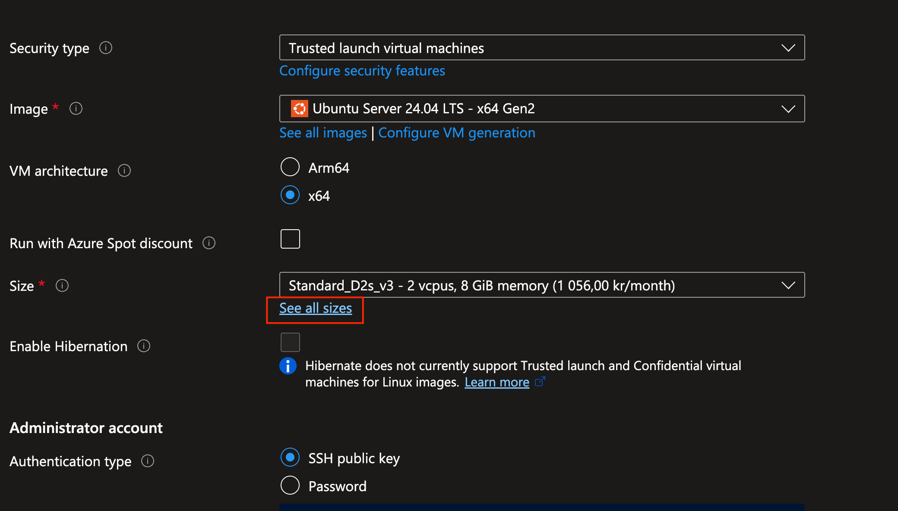
- Velg deretter det samme som bildet viser.
- 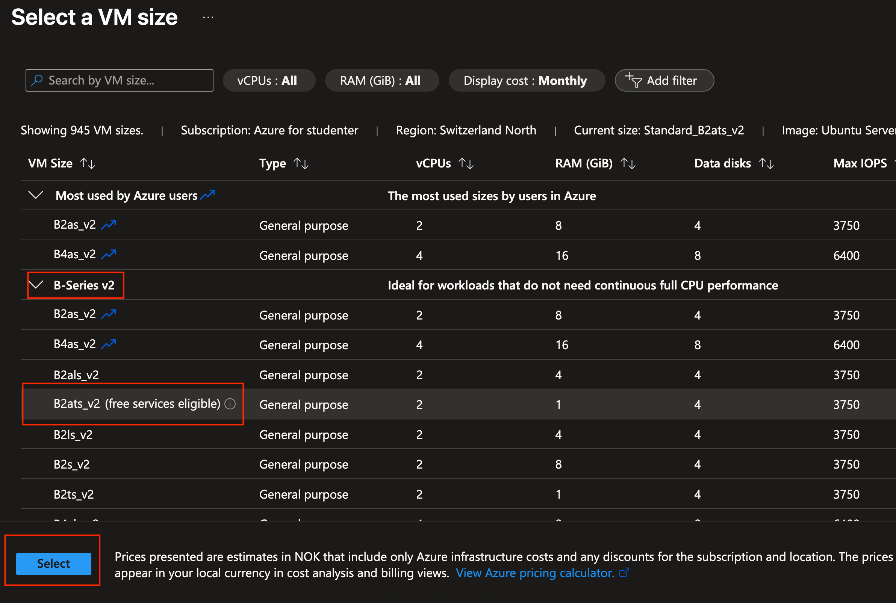
   - **Authentication type**: For å gjøre det enklet, velg passord. Skriv inn et ønsket brukernavn og følg veiledningen på passordlengde og kompleksitet.
   - 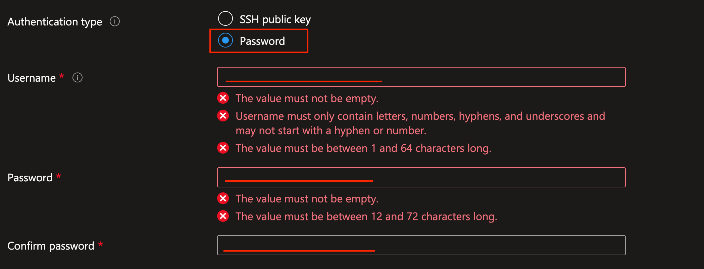
 - Velg å tillate port 22 inn til maskinen. MERK! Bare for testing, ikke god produksjonspraksis.
 - 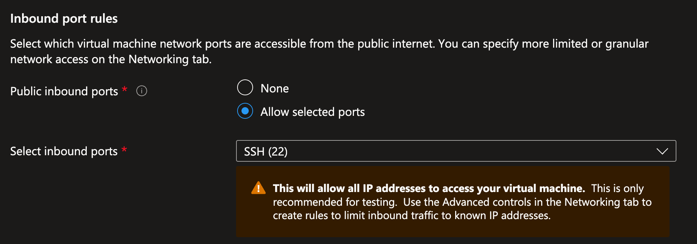
4. Trykk **Next: Networking** i toppen.

---

## 7. Koble VM til nettverket
1. Under **Virtual network**, velg det virtuelle nettverkt som du akkurat har opprettet
2. Under **Subnet**, velg subnet opprettet sammen med det virtuelle nettverket.
3. MERK: Public IP blir opprettet sammen med VM (New)
   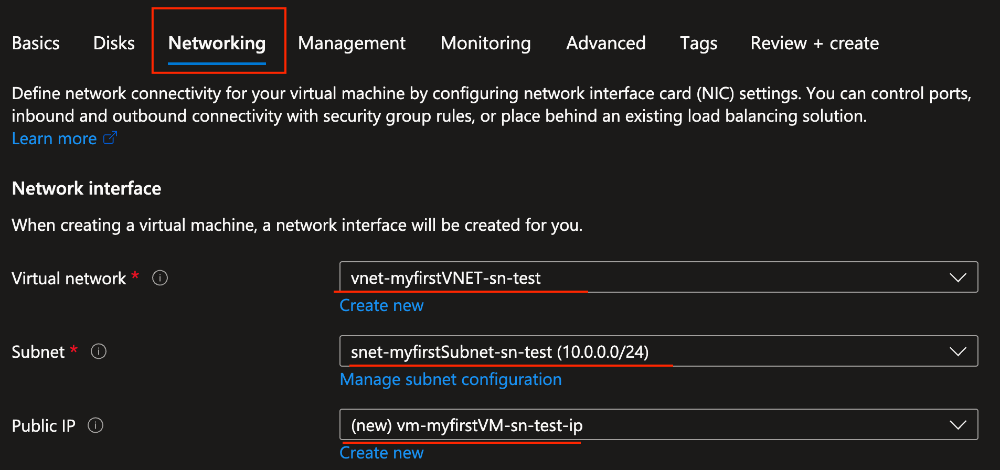
4. Under **NIC network security group**, velg **Advanced** og velg tidligere opprettet NSG
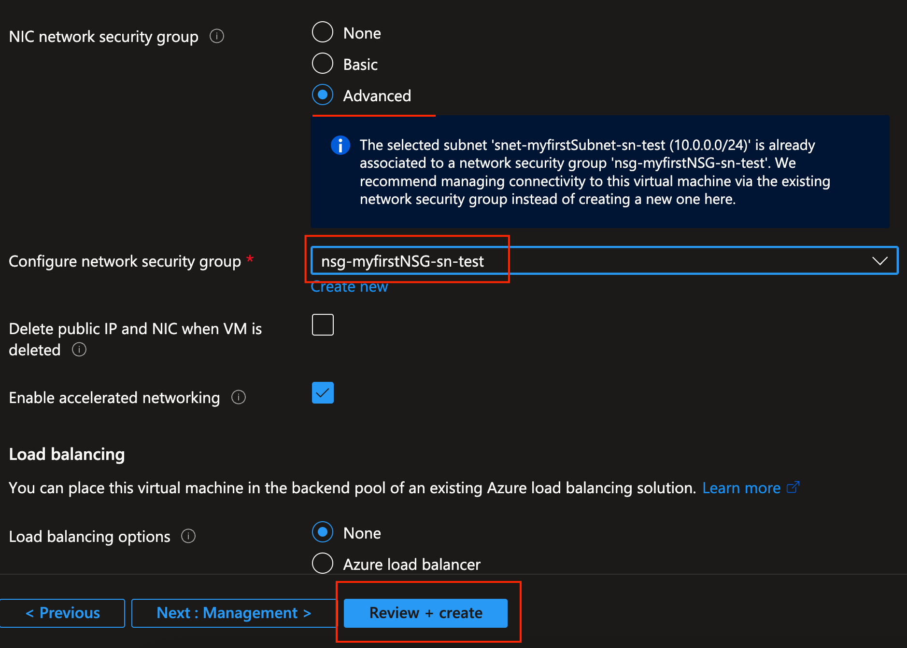
5. Trykk **Review + Create**, og deretter **Create**.
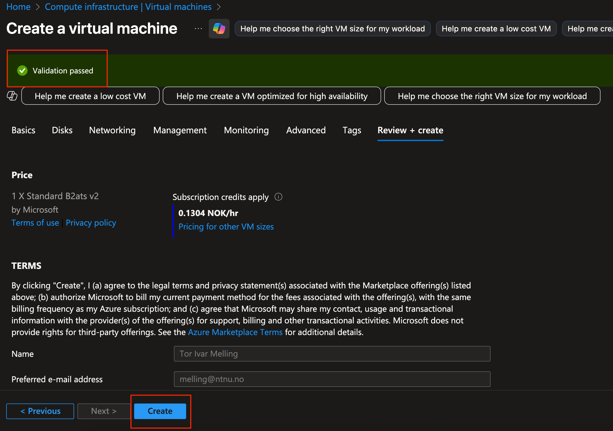
6. VM-en er ferdig opprettet når en ser følgende visning i nettleseren:
   - 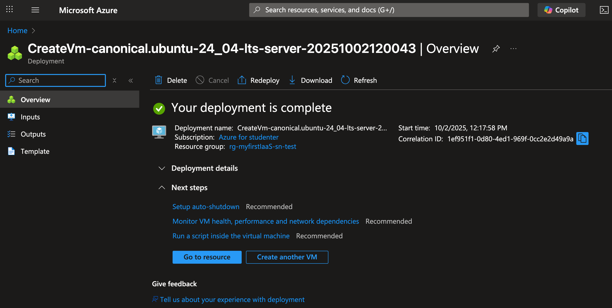
---

## 8. Koble til den virtuelle maskinen
Når opprettelsen er ferdig, kobler du deg til VM-en:

- **Linux**:  
  1. Finn frem til VM-en sin offentlige adresse ved å gå til Virtual Machines. En kan også klikke seg inn på VM-en om en ønsker enda mer informasjon om VM-en.
     1. 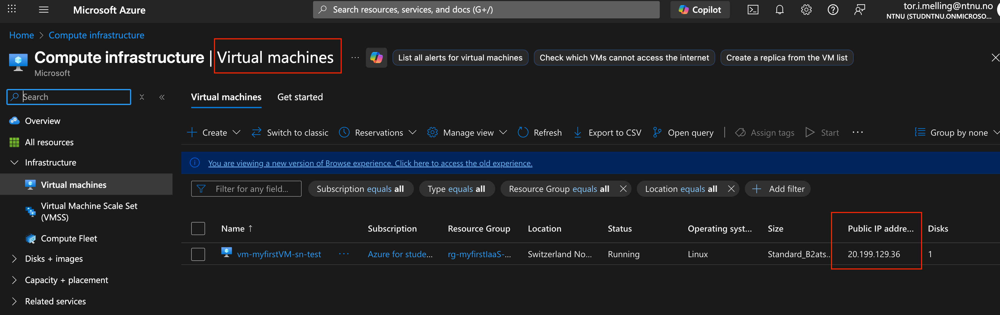  
  2. For å koble seg til maskinen kan en nå SSH inn til maskinen (terminal for macOS (command + spacebar -> skriv inn terminal) eller PowerShell for Windows (Trykk windowstast og skriv inn PowerShell)):  
     ```bash
     ssh <brukernavnetvedopprettelse av VM>@<offentlig-ip>
     ```
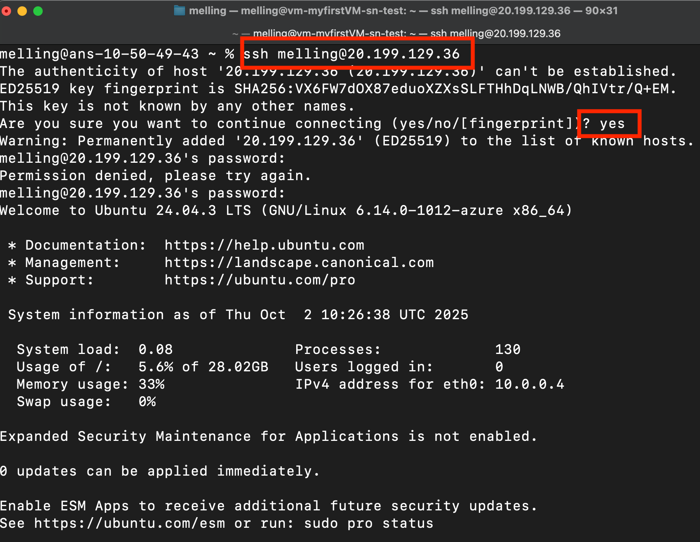
- Nå kan jeg skrive kommandoer direkte til VM-en som befinner seg i Microsoft Azure sitt datasenter.
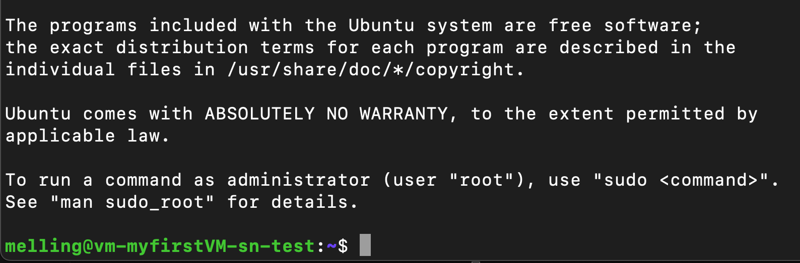
- **Windows**:  
  1. Klikk på **Connect** → **RDP**.  
  2. Last ned `.rdp`-filen og logg inn med brukernavn og passord.

---

## 9. Rydd opp (Viktig!)
Når du er ferdig med øvelsen, slett ressursgruppen for å unngå kostnader:  

1. Gå til **Resource groups**.  
2. Klikk **Delete resource group** i toppen og skriv inn navnet på Resource Groupen for å bekrefte..  
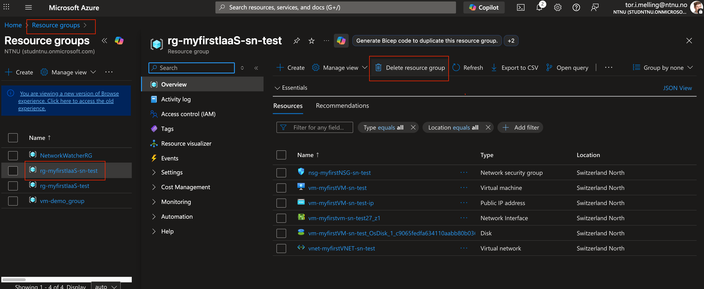
- Bekreft ved å skrive inn navn og huk av for å ta med alle ressursene.
- 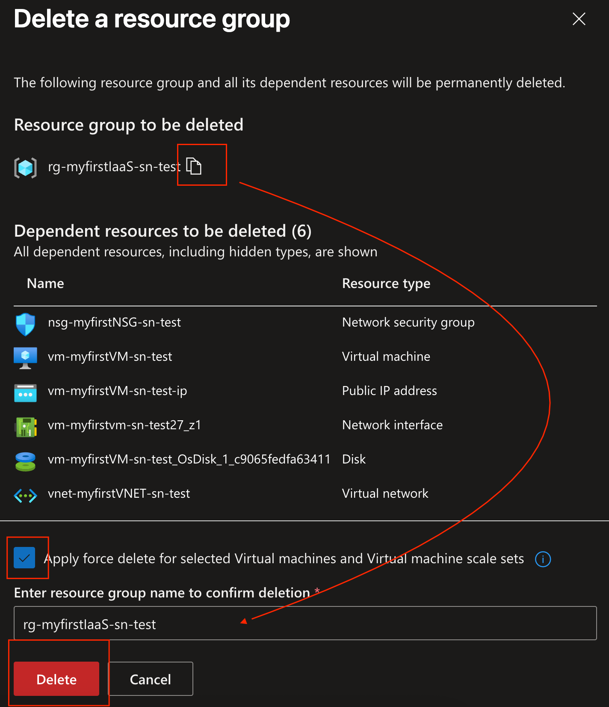

---

## Oppsummering
I denne øvelsen har du:
- Opprettet en ressursgruppe.  
- Bygget et virtuelt nettverk med subnet.  
- Konfigurert en Network Security Group og koblet den til subnettet.  
- Opprettet en VM og koblet den til det eksisterende nettverket.  
- Lært hvordan du kobler deg til VM-en og hvordan du rydder opp ressursene etterpå.  

---
